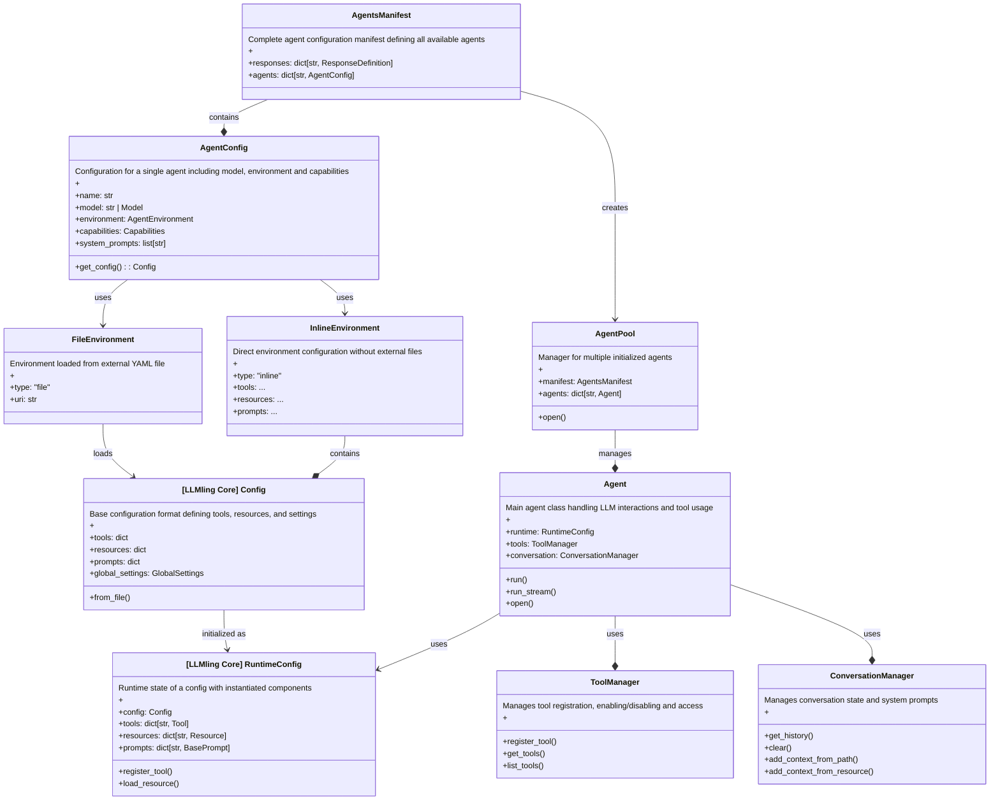

# LLMling-Agent

[](https://pypi.org/project/llmling-agent/)
[](https://pypi.org/project/llmling-agent/)
[](https://pypi.org/project/llmling-agent/)
[](https://pypi.org/project/llmling-agent/)
[](https://pypi.org/project/llmling-agent/)
[](https://pypi.org/project/llmling-agent/)
[](https://pypi.org/project/llmling-agent/)
[](https://pypi.org/project/llmling-agent/)
[](https://pypi.org/project/llmling-agent/)
[](https://github.com/phil65/llmling-agent/releases)
[](https://github.com/phil65/llmling-agent/graphs/contributors)
[](https://github.com/phil65/llmling-agent/discussions)
[](https://github.com/phil65/llmling-agent/forks)
[](https://github.com/phil65/llmling-agent/issues)
[](https://github.com/phil65/llmling-agent/pulls)
[](https://github.com/phil65/llmling-agent/watchers)
[](https://github.com/phil65/llmling-agent/stars)
[](https://github.com/phil65/llmling-agent)
[](https://github.com/phil65/llmling-agent/commits)
[](https://github.com/phil65/llmling-agent/releases)
[](https://github.com/phil65/llmling-agent)
[](https://github.com/phil65/llmling-agent)
[](https://github.com/phil65/llmling-agent)
[](https://github.com/phil65/llmling-agent)
[](https://codecov.io/gh/phil65/llmling-agent/)
[](https://github.com/psf/black)
[](https://pyup.io/repos/github/phil65/llmling-agent/)

### [Read the documentation! Unlike other frameworks, it doesnt mainly consist of "tools" ;)](https://phil65.github.io/llmling-agent/)

# 🚀 Getting Started

LLMling Agent is a framework for creating and managing LLM-powered agents. It integrates with LLMling's resource system and provides structured interactions with language models.

## ✨ Unique Features
- 🔄 Modern python written from ground up with Python 3.12
- 📝 Easy consistent APIs
- 💻 Pyodide-"compatible"
- 🛡️ Complete agent defintion via YAML files including extensive JSON schema to help with creating configurations.
- 🔒 Leveraging the complete pydantic-based type-safe stack and bringing it to the multi-agent world
- 🔌 Agent MCP server support, initialized when entering the async context.
- 👁️ Multi-modal support for both LiteLLM and Pydantic-AI (currently Images and PDFs if model support is given)
- 💾 Storage providers to allow writing to local files, databases, etc. with many customizable backends. Log to SQL databases and pretty-print to a file according to your own wishes.
- 🧩 Support for creating "description prompts" for many common python type(s / instances). Your agent understands common datatypes.
- 🎮 Complete integrated command sytem to control agents from prompt-based interfaces
- 🔗 Unique powerful connection-based messaging approach for object-oriented routing and observation.
- 🎯 Integration of Meta-Model system based on [LLMling-models](https://github.com/phil65/llmling-models), also configurable via YAML.
- 🔐 Deep integration of structured responses into workflows and (generic) typing system.
- 📋 Response type definition via YAML. Structured response Agents can be defined in the agent config.
- 🛡️ Capabilites system allowing runtime modifications and "special" commands (on-the-fly agent generation, history lookups)
- 📊 Complete database logging of Agent interactions including easy recovery based on query parameters.
- ⚙️ pytest-inspired way to create agents from YAML in a type-safe manner. "Auto-populated signatures."
- 🛜 Comletely UPath backed. Any file operations under our control is routed through fsspec to allow referencing remote sourcces.
- 📕 Integrated prompt management system.
- 🔧 Tasks, tools, and what else you can expect from an Agent framework.
- 🏎️ No fixed dependencies on all the super-heavy LLM libraries. Way faster startup than most other frameworks, and all IO in our control is async.
- 👥 Easy human-in-the-loop interactions on multiple levels (complete "providers" or model-based, see llmling-models)
- 💻 A CLI application with extensive slash command support to build agent flows interactively. Set up message connections via commands.
- ℹ️ The most easy way available to generate static websites in combination with [MkNodes](https://github.com/phil/mknodes) and  [the corresponding MkDocs plugin](https://github.com/phil65/mkdocs_mknodes)

## 🔜 Coming Soon
- 🎯 Built-in event system for reactive agent behaviors (file changes, webhooks, timed events)
- 🖥️ Real-time-monitoring via Textual app in truly async manner. Talk to your agents while they are working and monitor the progress!


### Why LLMling-agent? 🤔

Why another framework you may ask? The framework stands out through three core principles:


#### 🛡️ Type Safety and Structure
Unlike other frameworks that rely on free-form text exchanges, LLMling-agent enforces type safety throughout the entire agent interaction chain.
From input validation to structured outputs, every data flow is typed and validated, making it significantly more reliable for production systems.

#### 💬 Object-oriented async messaging and routing system
A powerful approach to messaging using Connection ("Talk") objects which allow all kind of new patterns for async agent communication

#### ⚙️ Rich Configuration System
While other frameworks require extensive Python code for setup, LLMling-agent introduces a comprehensive YAML configuration system.
This allows defining complex agent behaviors, capabilities, and interactions declaratively.
The configuration supports inheritance, composition, and strong validation, making it easier to manage large-scale agent deployments.

#### 🤝 Human-AI Collaboration
Instead of choosing between fully autonomous or human-controlled operations, LLMling-agent offers flexible human-in-the-loop integration.
From full human control to selective oversight of critical actions, or hooking in remotely via Network,
the framework makes it natural to build systems that combine AI capabilities with human supervision and interaction.


## Quick Start

The fastest way to start chatting with an AI:
```bash
# Start an ephemeral chat session (requires uv)
uvx llmling-agent[default] quickstart openai:gpt-4o-mini
```

This creates a temporary agent ready for chat - no configuration needed!
The according API keys need to be set as environment variables.

Use `help` to see what commands are at your disposal.

## Provider support

| Provider Type | Streaming Support | Multi-Modal Support | Structured Response Support | Dependency injection for tool usage |
|--------------|------------------|---------------------|---------------------------| --------------------------------- |
| PydanticAI | Yes | (Model dependent) | Yes | Yes |
| LiteLLM | Yes | (Model dependent) | Yes | Yes |
| Human-in-the-loop | Yes (but more a gimmick) | No | Yes | N/A |
| Callable-based | (Depends on callback) | (Depends on callback) | Yes | N/A |

(Multi-modal support (Images & PDF) in PydanticAI and LiteLLM depends on the underlying model's capabilities)


## 🚀 Quick Examples

Three ways to create a simple agent flow:


### Python Version
```python
from llmling_agent import AgentPool

async def main():
    async with AgentPool() as pool:
        # Create browser assistant
        browser = await pool.add_agent(
            "browser",
            system_prompt="Open Wikipedia pages matching the topics you receive.",
            model="openai:gpt-4o-mini",
            tools=["webbrowser.open"],
        )
        # Create main agent and connect
        agent = await pool.add_agent("assistant", model="openai:gpt-4o-mini")
        connection = agent >> browser  # this sets up a permanent connection.
        await agent.run("Tell us a random major city! Just one word!")
        print(connection.stats.total_cost)  # Check cost of this connection
```

This flow will:

- Ask the 1st agent to tell a major city
- Will make the 2nd agent open a related webpage using that info


### YAML Version
```yaml
# agents.yml
agents:
  browser:
    model: openai:gpt-4o-mini
    system_prompts:
      - "Open Wikipedia pages matching the topics you receive."
    tools:
      - type: import
        name: open_url
        import_path: webbrowser.open

  assistant:
    model: openai:gpt-4o-mini
    connections:  # this forwards any output to the 2nd agent
      - type: node
        name: browser
```

```bash
llmling-agent run assistant --config agents.yml "whats your favourite holiday destination?"
> What's your favorite holiday destination?
```


### CLI Version (Interactive using slash command system)
```bash
# Start session
llmling-agent quickstart --model openai:gpt-4o-mini
# Create browser assistant
/create-agent browser --system-prompt "Open Wikipedia pages matching the topics you receive." --tools webbrowser.open
# Connect the agents
/connect browser
# Speak to the main agent, which will auto-forward.
> What's your favorite holiday destination?
```

### YAML configuration

While you can define agents with 3 lines of YAML (or competely programmatic or via CLI),
you can also create agents as well as their connections, agent tasks, storage providers and much more via YAML.
This is the extended version

```yaml
# agents.yml
agents:
  analyzer:
    provider:  # Provider configuration
      type: "pydantic_ai"  # Provider type discriminator
      name: "PydanticAI Provider"  # Optional provider name
      end_strategy: "early"  # "early" | "complete" | "confirm"
      model:  # Model configuration
        type: "fallback"  # Lot of special "meta-models" included out of the box!
        models:  # Try models in sequence
          - "openai:gpt-4"
          - "openai:gpt-3.5-turbo"
          - "anthropic:claude-2"
      result_retries: 3  # Max retries for result validation
      defer_model_check: false  # Whether to defer model evaluation
      validation_enabled: true  # Whether to validate outputs
      allow_text_fallback: true  # Accept plain text when validation fails

    name: "Code Analyzer"  # Display name
    inherits: "base_agent"  # Optional parent config to inherit from
    description: "Code analysis specialist"
    debug: false
    retries: 1  # Number of retries for failed operations

    # Structured output
    result_type:
      type: "inline"  # or "import" for Python types
      fields:
        severity:
          type: "str"
          description: "Issue severity"
        issues:
          type: "list[str]"
          description: "Found issues"

    # Core behavior
    system_prompts:
      - "You analyze code for potential issues and improvements."

    # Session & History
    session:
      name: "analysis_session"
      since: "1h"  # Only load messages from last hour
      roles: ["user", "assistant"]  # Only specific message types

    # Capabilities (role-based permissions)
    capabilities:
      can_delegate_tasks: true
      can_load_resources: true
      can_register_tools: true
      history_access: "own"  # "none" | "own" | "all"
      stats_access: "all"

    # Environment configuration
    environment:
      type: "inline"  # or "file" for external config
      tools:
        analyze_complexity:
          import_path: "radon.complexity"
          description: "Calculate code complexity"
        run_linter:
          import_path: "pylint.lint"
          description: "Run code linting"
      resources:
        coding_standards:
          type: "text"
          content: "PEP8 guidelines..."

    # Knowledge sources
    knowledge:
      paths: ["docs/**/*.md"]  # Glob patterns for files
      resources:
        - type: "repository"
          url: "https://github.com/user/repo"
      prompts:
        - type: "file"
          path: "prompts/analysis.txt"

    # MCP Server integration
    mcp_servers:
      - type: "stdio"
        command: "python"
        args: ["-m", "mcp_server"]
        environment:
          DEBUG: "1"
      - "python -m other_server"  # shorthand syntax

    # Worker agents (specialists)
    workers:
      - type: agent
        name: "formatter"
        reset_history_on_run: true
        pass_message_history: false
        share_context: false
      - "linter"  # shorthand syntax

    # Message forwarding
    connections:
      - type: node
        name: "reporter"
        connection_type: "run"  # "run" | "context" | "forward"
        priority: 1
        queued: true
        queue_strategy: "latest"
        transform: "my_module.transform_func"
        wait_for_completion: true
        filter_condition:  # When to forward messages
          type: "word_match"
          words: ["error", "warning"]
          case_sensitive: false
        stop_condition:  # When to disconnect
          type: "message_count"
          max_messages: 100
          count_mode: "total"  # or "per_agent"
        exit_condition:  # When to exit application
          type: "cost_limit"
          max_cost: 10.0
    # Event triggers
    triggers:
      - type: "file"
        name: "code_change"
        paths: ["src/**/*.py"]
        extensions: [".py"]
        debounce: 1000  # ms
teams:
  # Complex workflows via YAML
  full_pipeline:
    mode: sequential
    members:
      - analyzer
      - planner
    connections:
      - type: node
        name: final_reviewer
        wait_for_completion: true
      - type: file
        path: "reports/{date}_workflow.txt"
# Response type definitions
responses:
  AnalysisResult:
    type: "inline"
    description: "Code analysis result format"
    fields:
      severity: {type: "str"}
      issues: {type: "list[str]"}

  ComplexResult:
    type: "import"
    import_path: "myapp.types.ComplexResult"

# Storage configuration
storage:
  providers:
    - type: "sql"
      url: "sqlite:///history.db"
      pool_size: 5
    - type: "text_file"
      path: "logs/chat.log"
      format: "chronological"
  log_messages: true
  log_conversations: true
  log_tool_calls: true
  log_commands: true

# Pre-defined jobs
jobs:
  analyze_code:
    name: "Code Analysis"
    description: "Analyze code quality"
    prompt: "Analyze this code: {code}"
    required_return_type: "AnalysisResult"
    knowledge:
      paths: ["src/**/*.py"]
    tools: ["analyze_complexity", "run_linter"]
```

You can use an Agents manifest in multiple ways:

- Use it for CLI sessions

```bash
llmling-agent chat --config agents.yml system_checker
```

- Run it using the CLI

```bash
llmling-agent run --config agents.yml my_agent "Some prompt"
```

- Use the defined Agent programmatically

```python
from llmling_agent import AgentPool

async with AgentPool("agents.yml") as pool:
    agent = pool.get_agent("my_agent")
    result = await agent.run("User prompt!")
    print(result.data)
```

- Start *watch mode* and only react to triggers

```bash
llmling-agent watch --config agents.yml
```


### Agent Pool: Multi-Agent Coordination

The `AgentPool` allows multiple agents to work together on tasks. Here's a practical example of parallel file downloading:

```python
# agents.yml
agents:
  file_getter:
    model: openai:gpt-4o-mini
    tools:
      - type: import
        import_path: llmling_agent_tools.download_file  # a simple httpx based async callable
    system_prompts:
      - |
        You are a download specialist. Just use the download_file tool
        and report its results. No explanations needed.

  overseer:
    capabilities:
      can_delegate_tasks: true  # these capabilities are available as tools for the agent
      can_list_agents: true
    model: openai:gpt-4o-mini
    system_prompts:
      - |
        You coordinate downloads using available agents.
        1. Check out the available agents and assign each of them the download task
        2. Report the results.

```

```python
from llmling_agent.delegation import AgentPool

async def main():
    async with AgentPool("agents.yml") as pool:
        # first we create two agents based on the file_getter template
        file_getter_1 = pool.get_agent("file_getter")
        file_getter_2 = pool.get_agent("file_getter")
        # then we form a team and execute the task
        team = file_getter_1 & file_getter_2
        responses = await team.run_parallel("Download https://example.com/file.zip")

        # Or let a coordinator orchestrate using his capabilities.
        coordinator = pool.get_agent("coordinator")
        result = await overseer.run(
            "Download https://example.com/file.zip by delegating to all workers available!"
        )
```

## Message System

LLMling provides a unified messaging system based on a simple but powerful concept: Every entity that can process messages is a message node. This creates a clean, composable architecture where all nodes:

1. Share a common interface:
   - `run()` -> Returns ChatMessage
   - `connect_to()` -> Creates connections
   - `message_received`: Message-received signal
   - `message_sent`: Message-sent signal

2. Can be freely connected:
```python
# Any message node can connect to any other
node_a.connect_to(node_b)
node_a >> node_b  # Shorthand syntax
```

The framework provides three types of message nodes:

1. **Agents**: Individual LLM-powered actors
```python
# Single agent processing
analyzer = pool.get_agent("analyzer")
result = await analyzer.run("analyze this")
```

2. **Teams**: Groups for parallel execution
```python
# Create team using & operator
team = analyzer & planner & executor
results = await team.run("handle this task")
```

3. **TeamRuns**: Sequential execution chains
```python
# Create chain using | operator
chain = analyzer | planner | executor
results = await chain.run("process in sequence")
```

The beauty of this system is that these nodes are completely composable:

```python

def process_text(text: str) -> str:
    return text.upper()

# Nested structures work naturally
team_1 = analyzer & planner  # Team
team_2 = validator & reporter  # Another team
chain = team_1 | process_text | team_2  # Teams and Callables in a chain

# Complex workflows become intuitive
(analyzer & planner) | validator  # Team followed by validator
team_1 | (team_2 & agent_3)  # Chain with parallel components

# Every node has the same core interface
async for message in node.run_iter("prompt"):
    print(message.content)

# Monitoring works the same for all types
print(f"Messages: {node.stats.message_count}")
print(f"Cost: ${node.stats.total_cost:.2f}")
```
(note: the operator overloading is just syntactic sugar. In general, teams should be created
using pool.create_team()/ pool.create_team_run() or agent/team.connect_to())
)
All message nodes support the same execution patterns:
```python
# Single execution
result = await node.run("prompt")

# Streaming
async with node.run_stream("prompt") as stream:
    async for chunk in stream:
        print(chunk)

# Iterator
async for message in node.run_iter("prompt"):
    print(message)

# Background execution
stats = await node.run_in_background("prompt", max_count=5)
await node.wait()  # Wait for completion

# Nested teams work naturally
team_1 = analyzer & planner  # First team
team_2 = validator & reporter  # Second team
parallel_team = Team([team_1, agent_3, team_2])  # Team containing teams!

# This means you can create sophisticated structures:
result = await parallel_team.run("analyze this")  # Will execute:
# - team_1 (analyzer & planner) in parallel
# - agent_3 in parallel
# - team_2 (validator & reporter) in parallel

# And still use all the standard patterns:
async for msg in parallel_team.run_iter("prompt"):
    print(msg.content)

# With full monitoring capabilities:
print(f"Total cost: ${parallel_team.stats.total_cost:.2f}")

```

This unified system makes it easy to:
- Build complex workflows
- Monitor message flow
- Compose nodes in any combination
- Use consistent patterns across all node types

Each message in the system carries content, metadata, and execution information, providing a consistent interface across all types of interactions. See [Message System](docs/concepts/messages.md) for details.


### Advanced Connection Features

Connections between agents are highly configurable and support various patterns:

```python
# Basic connection in shorthand form.
connection = agent_a >> agent_b  # Forward all messages

# Extended setup: Queued connection (manual processing)
connection = agent_a.connect_to(
    agent_b,
    queued=True,
    queue_strategy="latest",  # or "concat", "buffer"
)
# messages can queue up now
await connection.trigger(optional_additional_prompt)  # Process queued messages sequentially

# Filtered connection (example: filter by keyword):
connection = agent_a.connect_to(
    agent_b,
    filter_condition=lambda ctx: "keyword" in ctx.message.content,
)

# Conditional disconnection (example: disconnect after cost limit):
connection = agent_a.connect_to(
    agent_b,
    filter_condition=lambda ctx: ctx.stats.total_cost > 1.0,
)

# Message transformations
async def transform_message(message: str) -> str:
    return f"Transformed: {message}"

connection = agent_a.connect_to(agent_b, transform=transform_message)

# Connection statistics
print(f"Messages processed: {connection.stats.message_count}")
print(f"Total tokens: {connection.stats.token_count}")
print(f"Total cost: ${connection.stats.total_cost:.2f}")
```

The two basic programmatic patterns of this librry are:

1. Tree-like workflows (hierarchical):
```python
# Can be modeled purely with teams/chains using & and |
team_a = agent1 & agent2  # Parallel branch 1
team_b = agent3 & agent4  # Parallel branch 2
chain = preprocessor | team_a | postprocessor  # Sequential with team
nested = Team([chain, team_b])  # Hierarchical nesting
```

2. DAG (Directed Acyclic Graph) workflows:
```python
# Needs explicit signal connections for non-tree patterns
analyzer = Agent("analyzer")
planner = Agent("planner")
executor = Agent("executor")
validator = Agent("validator")

# Can't model this with just teams - need explicit connections
analyzer.connect_to(planner)
analyzer.connect_to(executor)  # Same source to multiple targets
planner.connect_to(validator)
executor.connect_to(validator) # Multiple sources to same target
validator.connect_to(executor) # Cyclic connections
```

BOTH connection types can be set up for BOTH teams and agents intiuiviely in the YAML file.

### Human-in-the-Loop Integration

LLMling-Agent offers multiple levels of human integration:

```python
# Provider-level human integration
from llmling_agent import Agent

async with Agent(provider="human") as agent:
    result = await agent.run("We can ask ourselves and be part of Workflows!")
```

```yaml
# Or via YAML configuration
agents:
  human_agent:
    provider: "human"  # Complete human control
    timeout: 300  # Optional timeout in seconds
    show_context: true  # Show conversation context
```

You can also use LLMling-models for more sophisticated human integration:
- Remote human operators via network
- Hybrid human-AI workflows
- Input streaming support
- Custom UI integration

### Capability System

Fine-grained control over agent permissions:

```python
agent.capabilities.can_load_resources = True
agent.capabilities.history_access = "own"  # "none" | "own" | "all"
```

```yaml
agents:
  restricted_agent:
    capabilities:
      can_delegate_tasks: false
      can_register_tools: false
      history_access: "none"
```

### Event-Driven Automation

React to file changes, webhooks, and more:

```python
# File watching
agent.events.add_file_watch(paths=["src/**/*.py"], debounce=1000)

# Webhook endpoint
agent.events.add_webhook("/hooks/github",port=8000)

# Also included: time-based and email
```

### Multi-Modal Support

Handle images and PDFs alongside text (depends on provider / model support)

```python
import PIL.Image
from llmling_agent import Agent

async with Agent(...) as agent:
    result = await agent.run("What's in this image?", PIL.Image.open("image.jpg"))
    result = await agent.run("What's in this image?", pathlib.Path("image.jpg"))
    result = await agent.run("What's in this PDF?", pathlib.Path("document.pdf"))
```

### Command System

Extensive slash commands available in all interfaces:

```bash
/list-tools              # Show available tools
/enable-tool tool_name   # Enable specific tool
/connect other_agent     # Forward results
/model gpt-4            # Switch models
/history search "query"  # Search conversation
/stats                   # Show usage statistics
```

### Storage & Analytics

All interaction is tracked using (multiple) configurable storage providers.
Information can get fetched programmatically or via CLI.

```python
# Query conversation history
messages = await agent.conversation.filter_messages(
    SessionQuery(
        since="1h",
        contains="error",
        roles={"user", "assistant"},
    )
)

# Get usage statistics
stats = await agent.context.storage.get_conversation_stats(
    group_by="model",
    period="24h",
)
```


```bash
# View recent conversations
llmling-agent history show
llmling-agent history show --period 24h  # Last 24 hours
llmling-agent history show --query "database"  # Search content

# View usage statistics
llmling-agent history stats  # Basic stats
llmling-agent history stats --group-by model  # Model usage
llmling-agent history stats --group-by day    # Daily breakdown
```

## 📚 MkDocs Integration

In combination with [MkNodes](https://github.com/phil65/mknodes) and the [MkDocs plugin](https://github.com/phil65/mkdocs_mknodes),
you can easily generate static documentation for websites with a few lines of code.

```python

@nav.route.page("Feature XYZ", icon="oui:documentation", hide="toc")
def gen_docs(page: mk.MkPage):
    """Generate docs using agents."""
    agent = Agent[None](model="openai:gpt-4o-mini")
    page += mk.MkAdmonition("MkNodes includes all kinds of Markdown objects to generate docs!")
    source_code = load_source_code_from_folder(...)
    page += mk.MkCode() # if you want to display source code
    result = agent.run_sync("Describle Feature XYZ in MkDocs compatible markdown including examples.", content)
    page += result.content
```


This diagram shows the main components of the LLMling Agent framework:




### [Read the documentation for further info!](https://phil65.github.io/llmling-agent/)
