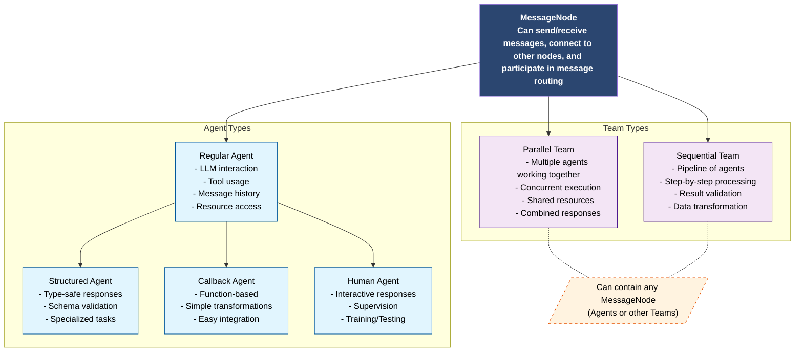

# Messages and Responses

LLMling's messaging system provides a unified way to handle communication between agents and teams. The system is built around two core concepts:

## Message Flow

Messages in LLMling-Agent can flow between:

- Individual agents
- Teams of agents
- Agents and teams
- External systems (through tools and connectors)

Each message carries not just its content, but also metadata about its journey through the system (costs, timing, routing information).

## Hierarchy



## Message Types

The system uses two main message types:

1. **ChatMessage**: The basic unit of communication

- Can contain either text or structured data
- Tracks metadata, costs, and routing information
- Used by both individual agents and teams
- Supports various formatting options for different interfaces

2. **TeamResponse**: Specialized response type for team operations

- Represents parallel or sequential execution results
- Contains individual agent responses
- Provides aggregated team statistics
- Can be converted to ChatMessage for unified handling

## Message Connections

Agents and teams can be connected to create message flows:

```python
# Direct connection
analyzer.connect_to(summarizer)

# Team connection
team.connect_to(reviewer)

# Chain connections
analyzer >> planner >> executor
```

Messages flowing through these connections maintain their metadata and can be:

- Transformed
- Filtered
- Queued
- Monitored

## Detailed Types

### ChatMessage

ChatMessage is LLMling's user-friendly message abstraction, providing a clean interface over the more technical implementation details of various AI libraries.

```python
class ChatMessage[TContent]:
    """Common message format for all interfaces."""

    content: TContent
    """Message content (string or structured data)"""

    role: "user" | "assistant" | "system"
    """Role of the message sender"""

    # Metadata
    name: str | None = None
    """Display name of the sender"""

    model: str | None = None
    """Model that generated this message"""

    message_id: str
    """Unique message identifier"""

    # Cost tracking
    cost_info: TokenCost | None = None
    """Token usage and cost information"""

    response_time: float | None = None
    """Time taken to generate response"""

    # Tool usage
    tool_calls: list[ToolCallInfo] = []
    """Tools used during message generation"""

    # Routing
    forwarded_from: list[str] = []
    """Chain of agents that forwarded this message"""
```

#### Usage Examples
```python
# Simple text message
msg = ChatMessage[str](
    content="Hello!",
    role="user"
)

# Structured content
msg = ChatMessage[AnalysisResult](
    content=AnalysisResult(score=0.8, issues=[...]),
    role="assistant",
    name="analyzer"
)

# Access cost information
if msg.cost_info:
    print(f"Tokens: {msg.cost_info.token_usage['total']}")
    print(f"Cost: ${msg.cost_info.total_cost:.4f}")

# Format for display
print(msg.format("simple"))     # Basic format
print(msg.format("detailed"))   # With metadata
print(msg.format("markdown"))   # As markdown
```

### TeamResponse

TeamResponse represents the combined results from multiple agents working together:

```python
class TeamResponse(list[AgentResponse]):
    """Collection of responses from team execution."""

    @property
    def duration(self) -> float:
        """Total execution time."""

    @property
    def success(self) -> bool:
        """Whether all agents completed successfully."""

    @property
    def failed_agents(self) -> list[str]:
        """Names of agents that failed."""

    def by_agent(self, name: str) -> AgentResponse | None:
        """Get response from specific agent."""
```

#### Usage Examples
```python
# Execute team
team = pool.create_team(["analyzer", "planner", "executor"])
response = await team.run_parallel("Process this task")

# Access results
for agent_response in response:
    print(f"{agent_response.agent_name}: {agent_response.message.content}")
    if not agent_response.success:
        print(f"Error: {agent_response.error}")

# Get specific agent's result
if analyzer := response.by_agent("analyzer"):
    print(f"Analysis: {analyzer.message.content}")

# Format execution times
print(response.format_durations())

# Convert to single message
combined = response.to_chat_message()
```

Both ChatMessage and TeamResponse provide clean abstractions over the complexity of agent interactions,
making it easy to work with both individual and group responses in a consistent way.
