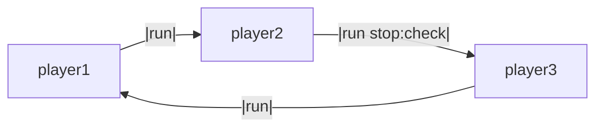

# Round-Robin Communication

This example demonstrates how to set up a cyclic communication pattern between agents using LLMling's connection system.

## Basic Setup

Create a word chain game where each agent must respond with a word starting with the last letter of the previous word:

```yaml
prompts:
  system_prompts:
    word_chain:
      type: role
      content: "Respond with a word that starts with the last letter of the given word."

agents:
  player1:
    model: gpt-3.5-turbo
    library_system_prompts:
      - word_chain
    connections:
      - type: agent
        name: player2  # All messages are forwarded in a circle

  player2:
    model: gpt-3.5-turbo
    library_system_prompts:
      - word_chain
    connections:
      - type: agent
        name: player3

  player3:
    model: gpt-3.5-turbo
    library_system_prompts:
      - word_chain
    connections:
      - type: agent
        name: player1
        stop_condition:  # NOTE: this only checks the cost for this "connection"
          type: cost_limit
          max_cost: 0.05
```


!!! note
    Mermaid diagrams can be generated using pool.get_mermaid_diagram() for a whole pool, as well as
    TalkManager.get_mermaid_diagram() for a single agent.

## Running the Example

Start the chain by sending a word to player1:

```bash
llmling-agent run player1 "start" --show-messages
```

Example output:
```
player1: "tree"
player2: "elephant"
player3: "tiger"
player1: "robot"
...
```

## How it Works

1. Each agent is configured with the same system prompt defining the word chain game
2. Agents are connected in a circle: player1 -> player2 -> player3 -> player1
3. Messages flow through the connections automatically
4. Optional stop condition can terminate the loop when needed


## Adding Controls

You can add various conditions to control the conversation:

- Stop condition to end the chain based on cost/tokens/messages
- Transform function to modify messages
- Filter condition to control which messages pass through
