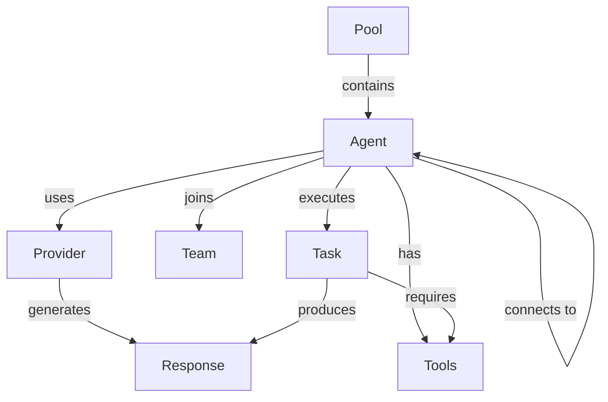

# Basic Concepts

## Core Components

### Agents
An Agent in LLMling-agent is best thought of as an "agent framework" or "agent container" rather than an agent itself. It provides the infrastructure and orchestration for agent-like behavior, but delegates the actual "thinking" to providers.

Key aspects:
- Manages infrastructure (tools, history, connections)
- Handles message routing and tool execution
- Provides type safety and validation
- Integrates with storage and events
- Coordinates with other agents

The actual agent behavior (language model, human input, etc.) is pluggable via providers.

### Configuration and YAML
LLMling-agent excels at static definition of agents using YAML files and Pydantic models:

```yaml
# agents.yml (AgentsManifest)
agents:
  analyzer:    # AgentConfig
    model: "openai:gpt-4"
    system_prompts: [...]
    capabilities: {...}
    environment: {...}
  planner:
    model: "anthropic:claude-2"
    ...
```

The hierarchy is:
- **AgentsManifest**: Top-level configuration (YAML file)
  - Defines available agents
  - Sets up shared resources
  - Configures storage
  - Defines response types
- **AgentConfig**: Per-agent configuration (YAML section)
  - Sets model/provider
  - Defines capabilities
  - Configures environment
  - Sets up knowledge sources

All configuration is validated using Pydantic models, providing:
- Type safety
- Schema validation
- IDE support
- Clear error messages

### Providers
Providers implement the actual "agent behavior". The Agent class provides the framework, while providers handle the "thinking":

- **AI Provider**: Uses pydantic-ai and language models
- **Human Provider**: Gets responses through human input
- **Callback Provider**: Uses Python functions
- **LiteLLM Provider**: Uses LiteLLM for model access

### Pools
A Pool is a collection of agents that can:
- Share resources and knowledge
- Discover each other
- Communicate and delegate tasks
- Be monitored and supervised

Think of a pool as a workspace where agents can collaborate.

### Teams
Teams are dynamic groups of agents from a pool that work together on specific tasks. They support:
- Parallel execution
- Sequential processing
- Controlled communication
- Result aggregation

### Connections
Connections define how agents communicate. They include:
- Direct message forwarding
- Context sharing
- Task delegation
- Response awaiting

Connections can be:
- One-to-one
- One-to-many
- Temporary or permanent
- Conditional or unconditional

### Tasks
Tasks are pre-defined operations that agents can execute. They include:
- Prompt templates
- Required tools
- Knowledge sources
- Expected result types
- Execution strategies

## Mental Model

### Message Flow
1. User/system sends message to agent
2. Agent processes via provider
3. Provider may use tools
4. Response is generated
5. Message may be forwarded via connections
6. Results are collected and returned

### Component Relationships


### Lifecycle
1. Pool initialization
2. Agent creation and configuration
3. Connection setup
4. Message processing
5. Tool execution
6. Response handling
7. Optional forwarding
8. History storage

## Key Patterns

### Component Setup
```python
# Create pool from manifest
async with AgentPool.open("agents.yml") as pool:
    # Get agent
    agent = pool.get_agent("analyzer")
    # Create team
    team = pool.create_group(["analyzer", "planner"])
    # Connect agents
    analyzer >> planner  # Forward results
```

### Message Processing
```python
# Basic usage
result = await agent.run("Analyze this code")

# Structured responses
result = await agent.to_structured(AnalysisResult).run("Analyze this code")

# Team execution
result = await team.run_parallel("Process this")
```
