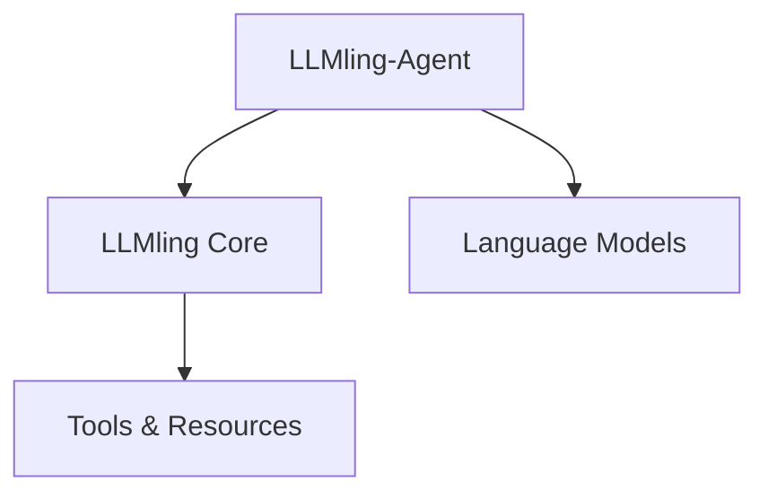

# Key Concepts

## LLMling and LLMling-Agent

LLMling-Agent extends LLMling's environment system to provide easy-to-configure agents:



### LLMling Core Provides
- Resource management (files, APIs, databases)
- Tool registration and execution
- Environment configuration
- Template processing
- Prompt management

### LLMling-Agent Adds
- Pure YAML-based agent configuration
- Interactive chat sessions (CLI and web)
- Model interaction handling
- Session state management
- History tracking

## Core Strengths

### YAML-First Philosophy
LLMling-Agent is built around the idea that AI agents should be:
- Easily configurable through YAML
- Fully reproducible
- Version controllable
- Human readable and verifiable
- Shareable across teams and projects

This means you can define complete agents, their capabilities, and their environments in pure YAML without writing any code.

### Universal Resource Access
Thanks to UPath integration, agents can work with resources from anywhere:
- Local files
- Remote URLs (http, https, s3, etc.)
- Git repositories
- Cloud storage
- Any UPath-supported protocol

Dependencies are handled automatically - if an agent needs specific packages to interact with resources, they're installed on demand.

## Usage Patterns

### 1. YAML-Based Configuration

Define complete agents in YAML without writing code:

```yaml
# agents.yml
agents:
  web_assistant:
    model: openai:gpt-4
    tools:
      - type: import
        name: open_url
        import_path: webbrowser.open
    system_prompts:
      - "You are a helpful web assistant."
```

### 2. Interactive Sessions

Quick access to agents through CLI or web interface:

```bash
# CLI chat
llmling-agent chat web_assistant

# Web interface
llmling-agent launch
```

Both interfaces provide a consistent command system using slash commands:

```bash
/list-tools              # Show available tools
/enable-tool <name>      # Enable a tool
/disable-tool <name>     # Disable a tool
/show-resource <name>    # View resource content
/register-tool <path>    # Add new tool
/set-model <model>       # Change model
/history show           # View chat history
/stats                  # Show usage statistics
/help                   # Show all commands
```

### 3. Programmatic Usage

```python
from llmling_agent import Agent

async with Agent(..., tools=["webbrowser.open"]) as agent:
    result = await agent.run("Open Python website")
```

## Tools and Resources

LLMling-Agent leverages LLMling's resource system, providing agents with access to:

### Tools
- File operations
- API interactions
- System commands
- Custom Python functions

### Resources
- File content
- API endpoints
- Database connections
- Memory storage
- Template systems

All tool and resource access is:
- Configurable through YAML
- Permission controlled
- Usage tracked
- Error handled

## Agent Capabilities

Agents have role-based capabilities that control their access to:
- Tool usage
- Resource access
- History viewing
- Statistics access

> **Note**: All agents are aligned with the Model Context Protocol (MCP), ensuring consistent
> interaction patterns across different models and configurations.

For detailed configuration options, see:
- [Agent Configuration](https://github.com/phil65/llmling-agent/blob/main/docs/agent_config.md)
- [LLMling Environment Documentation](https://github.com/phil65/llmling)
