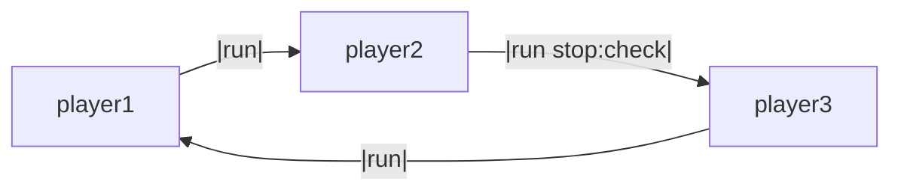

# Round-Robin Communication

This example demonstrates how to set up a cyclic communication pattern between agents using LLMling's connection system.



!!! note
    Mermaid diagrams can be generated using pool.get_mermaid_diagram() for a whole pool, as well as
    ConnectionManager.get_mermaid_diagram() for a single agent.

## Running the Example

Start the chain by sending a word to player1:

```bash
llmling-agent run player1 "start" --show-messages
```

Example output:
```
player1: "tree"
player2: "elephant"
player3: "tiger"
player1: "robot"
...
```

## How it Works

1. Each agent is configured with the same system prompt defining the word chain game
2. Agents are connected in a circle: player1 -> player2 -> player3 -> player1
3. Messages flow through the connections automatically
4. Optional stop condition can terminate the loop when needed


## Adding Controls

You can add various conditions to control the conversation:

- Stop condition to end the chain based on cost/tokens/messages
- Transform function to modify messages
- Filter condition to control which messages pass through
